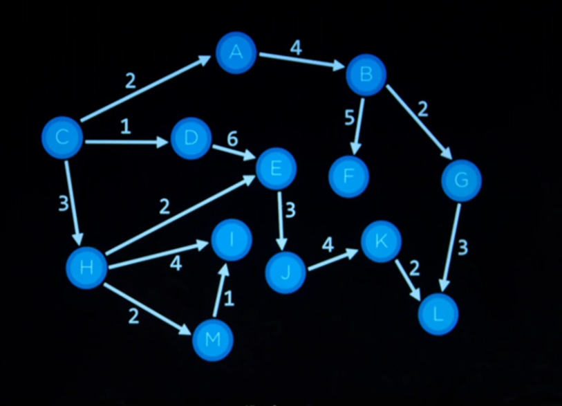

# Agent

entity that percieves its enviroment and acts upon that enviroment

# Inicial State

The firt position of the entity

# Actions

choices that can be in a state

# Transition model

gives the state after an action

# State space

States connect to each other based on actions

# Path cost

how expensive is it to take a certain option

# Node

state
a parent
an action
a path cost

# Stack

LIFO

# Queue

FIFO

# Types of search

BFS
DFS
